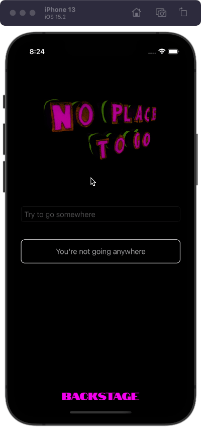
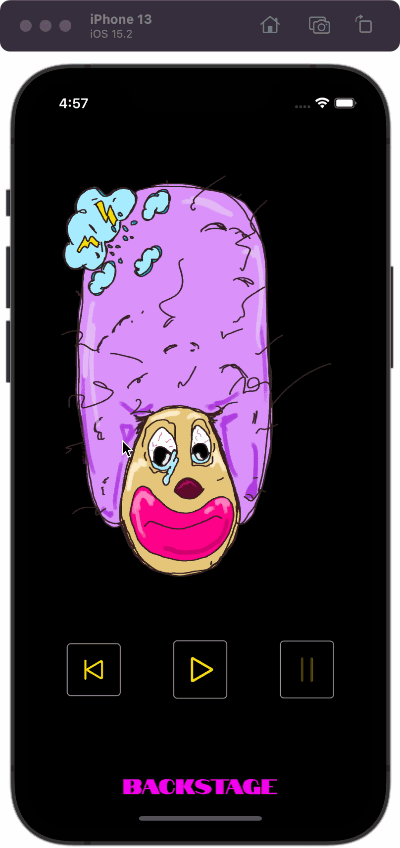
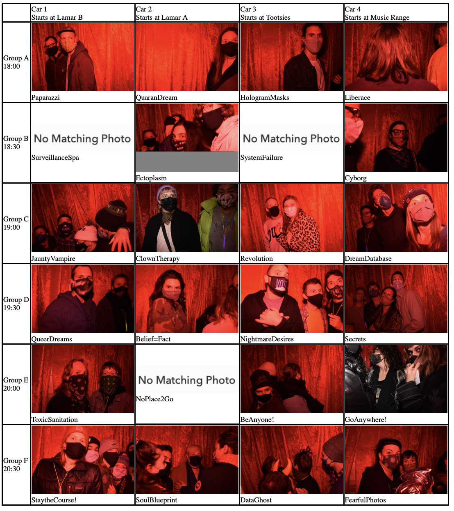

# No Place to Go (NP2G)

[Available for iOS on the App Store](https://apps.apple.com/us/app/no-place-to-go/id1535357331).

[No Place to Go](https://www.no-place-to-go.com) was a socially distanced haunted house running in October 2020. I was commisioned to develop the iOS app to incorporate installation-specific content and coordinate the motion of single-car groups rotating through five sites. I worked with the project directors and all 15 artists (and artist groups) to realize their visions for a unique immersive experience.

I vividly remember calling every artist group early on in the project. Almost everyone was initially unsure, even intimidated, by the idea of the app and the tech involved but I quickly broke through the ice and we had rich discussions about the project that made me say to myself, "I am so glad that this is my job."

The app targeted iOS 13.6 and was written exclusively in Swift and SwiftUI. Some of the main technical considerations were:

- Playing audio tracks while traveling between locations that would pause if controled by the user or if leaving the app to get directions. Utilizes `AVAudioPlayer` from `AVFoundation`.
- Navigating an on-device (simulated) phone tree with instructions read with `AVSpeechSynthesizer` from `AVFoundation`.
- Working with an artist to quickly upload photos via FTP to a server that would ultimately be shown to the corresponding group after an in-app trigger. Utilizes `URLSession`.
- Using a matrix of code phrases ("passwords") for each night of the event to unlock the app and start each group in the appropriate pre-planned location.

## Code Phrase Entry (Group Assignment)

There were four car groups and six time slots per night, each of which (all 24 groups) had a unique code that would assign their starting location within the app.

## Between-Site Guidance
Specific engineered audio tracks play between each site on these transition pages. The audio starts automatically but can be paused manually and will pause of the user clicks the button to get driving directions. The app does not allow users to go back or to restart so they are asked to confirm that they have arrived before they see the next screen.

## Letting Go -- Emily & Michaela
After asking the user to let something of great importance go, they are asked to confirm and then randomly shown a message:

- "How heartless of you"
- "Great choice!"
- "Are you sure? ... very well"

Afterward, there is an "eye scan" animation before this portion of the interaction completes. The eye scan is completely fictional and no scan is actually performed.

## Clown -- Moe Graham

This screen plays audio and it proceeds when completed. The user can can play, pause, and restart the audio on their own. This view can be bypassed (e.g., for testing) by long pressing the image or three seconds. 

## Photo Booth -- Hayley Krichels

Users only have a simple directions screen at this point but the app has logic to later show them their group's photo. This was set up with Hayley to upload photos from a computer via FTP and then then the app would request images at pre-determined URLS based off of car groups.

 

## Liberace's -- Chrissy & Grace

After advancing through the hall with Liberace, guests enter a strange area at the same time that they see a countdown from 10, a devilish figure, and an ominous EKG.

 

## Surveillance Spa -- Nicole Banowetz

Guests would answer questions in the app as they approached the installation where they would also respond to questions into a microphone in a sound-responsive kiosk where I also created the visualization and electronics. The installation also had an inflatable sculpture that was illuminated and inflated based on the movements of a dancer/performer wearing a costume that communicated wirelessly with the sculpture using electronics that I built.

 

## Surveillance Spa -- Nolan Tredway

. The "genders" are related to four alien figures presented in this location. Again, no information is collected in the app.

## Phone Tree -- Renee & Hayley D.

Unfortunately, none of the fun of this portion of the app comes through in an animated GIF. I worked with the artists to make a CSV file that powers this voice synthesized phone tree. Users are asked questions and use the number buttons to respond. This was also built as a standalone iPad app for anyone not using the iOS app.

## Backstage

At any time before, during, or after the event, users can bpull up additional "Backstage" information about No Place to Go, the artists, directors, and installations. 

## In Others' Words

> [T]ech master Bryan Costanza came on board to design an **app** to help audience members navigate their vehicles through the interactive elements of the individual installations. -- [Westword](https://www.westword.com/arts/no-place-to-go-is-a-queer-immersive-drive-through-haunted-house-11825848)

...

> There they’ll unlock a smartphone **app** (to be downloaded in advance) that guides their staggered, overlapping journeys through the otherworldly installations. [The Know, Denver Post](https://theknow-old.denverpost.com/2020/10/22/no-place-to-go-rainbow-militia-deaths-unraveling/247376/)

...

> We’d downloaded the NP2G **app**-designed by Bryan Costanza ahead of the event. An organizer walked up to the driver-seat window and gave us a secret code to enter into the **app**, which gave us directions to each stop on the route: five abandoned storefronts, shops and window displays through which we could watch performances safely through a barrier, all within a two-mile area within Wheat Ridge and the 40 West Arts District.
>
>The **app** also played narration voiced by James Brunt, whose voice guided us through the “no place,” weaving together the artists’ disjointed ideas and fears into a cohesive — if absurdist — narrative. A spooky score by Mike Clark provided the soundtrack to our journey as we drove from installation to installation, and at each stop, the **app** offered contactless, choice-based interactions with the installations. -- [Denverite](https://denverite.com/2020/10/20/no-zombies-or-jump-scares-this-artist-designed-haunted-house-gives-you-a-safe-way-to-process-day-to-day-fears/)

...

> The No Place to Go **App** designed by Bryan Costanza provides each car with a unique show route as well as a sound score designed by Mike Clark to accompany the audience as they drive between sites. The **App** also provides additional show information and custom-made interactions with the installations to create a contactless experience. -- [NP2G Press Release](https://www.no-place-to-go.com/2020/09/18/press-release-no-place-to-go-in-fearful-times/)